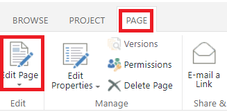

<h1>People Picker</h1>
This example is a client-side people picker that allows for selecting mulitple people. It uses Enterprise Customizeable Fields (ECF) to create the service.
 
 
<h2>How to Create</h2>
- Open the "PWA Settings"  
 
- Create a new field in the menu. Be sure the property "Entity" is set to "Project" and the property "Type" is set to "Text".
 
- Go back to the PWA settings menu and this time go to "Project Details Page" 
 
- Select the page that you want to add the people picker to.
- At the top of the page, select "Page" then "Edit Page". 
 
- Now it is time to add the ECF to the page. If the ECF is already on the page, skip to the Content Editor. If it is not on the page, it will need to be added. The easiest way to do this is to add a new "Basic Info" web part under the folder for "Project Web App". When the basic info field is added, select modify in the settings for the web part and add the new ECF to the web part. 
- When the ECF is on the page, add a new web part called "Content Editor" located under the "Media and Content". Use the tiny drop down arrow in the top right corner of the web part to open the settings and select "Edit Web Part". 
 
- Now we need to add the javascript for the people picker to the Content Editor. If not already done, add the javascript in this folder (Multi_People_Picker.js) to the assets of the Project site. My favorite way is to add a new folder called "Scripts" to hold all of my scripts I use throughout the Project. 
- Once the javascript is added to the assets of the site, add the relative path to the "Content Link" in the "Content Editor" settings. An example would be <b>/sites/pwa/Scripts/Multi_People_Picker.js</b>
- Under "Layout" in the "Content Editor" settings, select the checkbox for "Hidden". This will hide the Content Editor on the page as it is not needed to be shown. Select "Apply" to lock in the settings. 
 
- Now you can close the editor and open the page as a user. The People Picker should work.  
 